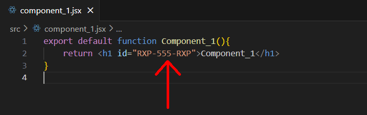
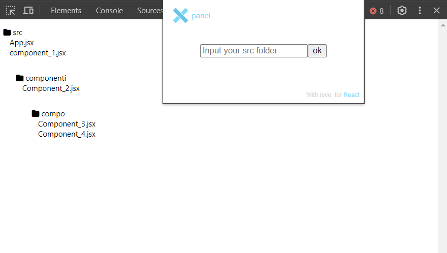
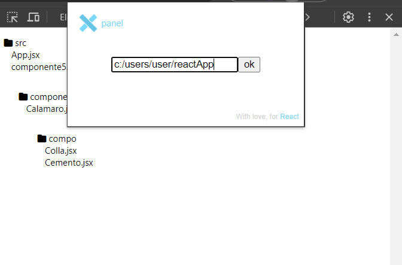

# REACT X PANEL 

here is a video tutorial: https://youtube.com/watch?v=t24S-LFsc8c

#### 💡It is a chrome extension that can improve and speed up the debugging process for react applications 

📈It resolves the common problem that occours in every Big React Application,
when there is something to change it's so hard to find the relative file component, maybe nested in another component, nested in another component and so on..

🔎So basically this extension, to find that file is simple as hover on the element.

✅Yes, just by hovering on that element you can see the path of that element like "/src/component/navbar.jsx"

**In addition you can open directly that file in Visual Studio Code by clicking on it.**

 

1. React x panel recognizes every component that follows this pattern RXP-\<id>-RXP, where \<id> is unique identifier that you can choose, **so you have to add this id on every component that you want to track, otherwise it will be ignored**, like this:

 

 

2. Then, in google chrome follow these steps in the dev tool (on the url of your application)

 

 

3. That's the result

 

 

4. Now you can prompt your react app src (without /src at the end) like this:

 

 

5. Now you can finally debug your react app ☀️

